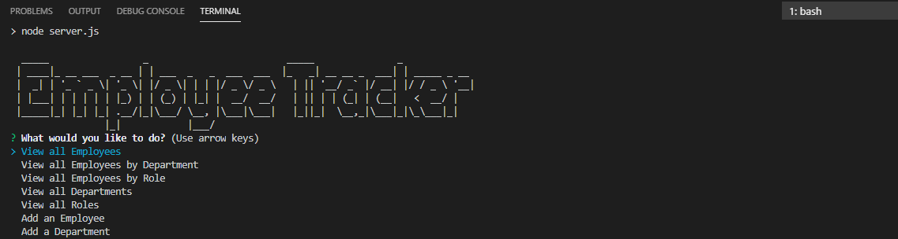

# Employee-Tracker

## Table of Contents
* [General Info](#general-info)
* [Technologies](#technologies)
* [Screenshots](#screenshots)
* [Credits](#credits)
* [License](#license)

## General Info
This project is a command-line application that can be used to manage a company's employees using node, inquirer, and MySQL. 
First the user must use the following command to install dependencies required:
```sh
npm install
```
The application is then invoked with the following commands:
```sh
node server.js
```
The user is then prompted with a list of choices to view, add, update or delete the database, and information is displayed to them in a table in the console. 


## Technologies
This project is created with: 
* Node.js 
* HTML
* JavaScript
* mySQL
* mySQL Workbench

## Screenshots 



# Credits
I consulted my course GitLab repository, Stack Overflow (www.stackoverflow.com), W3Schools (https://www.w3schools.com/js/js_array_methods.asp), MDN Web Docs (https://developer.mozilla.org/en-US/docs/Web/API/Console/table), SQL Bolt (https://sqlbolt.com/lesson/select_queries_with_outer_joins) and MySQL Tutorial (https://www.mysqltutorial.org/mysql-nodejs/update/) in creating my project. 

## License
MIT License

Copyright (c) [2020] [Rachel Rohrbach]

Permission is hereby granted, free of charge, to any person obtaining a copy
of this software and associated documentation files (the "Software"), to deal
in the Software without restriction, including without limitation the rights
to use, copy, modify, merge, publish, distribute, sublicense, and/or sell
copies of the Software, and to permit persons to whom the Software is
furnished to do so, subject to the following conditions:

The above copyright notice and this permission notice shall be included in all
copies or substantial portions of the Software.